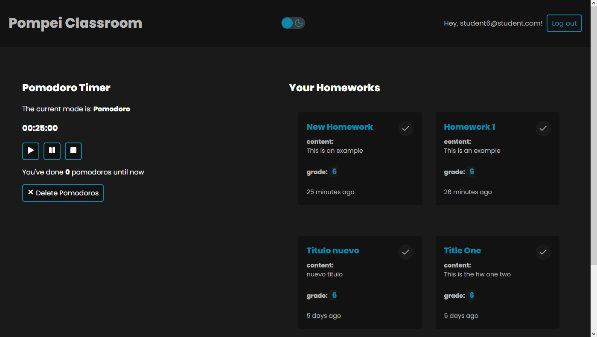

# Pompei Classroom

This is a public version of the full-stack app designed for the Nuestra Señora de Pompei school (Caracas, Venezuela).

An excellent tool for teachers, students, and even parents; to keep track, manage and organize the academic workload and homework status of each student based on their current grade.

**Live site URL:**  [Here](https://pompei-classroom.vercel.app)

## Why Was This App Made

After the COVID pandemic hit, many challenges were thrown at both the student body, and the teaching staff of the Pompei school. Having a centralized place where the user (student or teacher) could access and have their organized pending homework quickly became a necessity. 

There are alternatives to this tool out on the market, though. Apps even developed by some of the biggest and strongest of names within the tech industry. However, access to the licensing was an issue for the Pompei school due to their economic situation.

I, as a teacher of said institution, decided to take action and put my coding knowledge into building a free platform for us all to benefit. Thus making "Pompei Classroom" a reality.

As a bonus, whenever the app is accessed by a student, theres a little nugget of the [Viking Productivity Suite's](https://github.com/AlfredoCabrera-Tech/viking-productivity-suite) pomodoro timer component, made to help students on their process making use of one of the most effective productivity strategies there are. The Pomodoro Technique. 

## What Does This App Do?

This app is based on 4 important components that can explain its functionality:

1. **Authorization.**
   
  This means each "portal" is for individual use. This is not meant to be a social network, but a platform centralize and organize the workload in an effective manner. 

2. **CRUD app.**
   
  CRUD stands for Create, Read, Update, and Delete. This means the teachers can manipulate and manage each homework's content. Every new homework they create and every modification they make persists in the database; every one they delete is deleted permanently too; and, while students can access only their corresponding homework according to their current grade, teachers can access any of the items they have created themselves.

3. **Mark as Done Utility.**
   
  Taking into account the main objectives of this app ("to keep track, manage and organize..."), one big aspect needed by students is the ability to mark which items on the list are done, and having it be easily identifiable.

4. **Pomodoro Timer.**
  
  The 'Pomodoro Technique' is a time management strategy built around the idea of scheduling rest into your workflow as a way to keep your mind focused and consequently optimizing the productivity cycle.

## How It Was Made

**Tech used:**  JavaScript, React JS, Custom Hooks, Custom Contexts and Reducers on ReactJS, React-Router, API requests, MVC, CRUD functionality, NodeJS, ExpressJS, MongoDB, MongooseJS, JWT auth, Browser's LocalStorage, and many more.

This app is conceived to provide both the student body and the teaching staff of the Pompei school with a platform to centralize and organize their workload.

#### Frontend

**JavaScript/React JS:**

This app was based on the create-react-app npm package's folder structure. Every component is a function-based component.

The frontend functionality of this application has a great deal of custom-made script. Starting with custom hooks made to handle the signup, login, logout and overall authentication verification behaviour; just as important, some of those custom hooks were made to handle the different contexts taking place in this program.

Regarding said contexts, the diferent pieces of data being accessed to and from the database, the homeworks themselves being handled throughout every appropriate component, and the authentication status of the user designed to ensure exclusive access to each individual's content; were done using React's useContext hook and, in most cases, useReducer too to handle complex stateful matrixes.

A Timer component based around the 'Pomodoro Technique' using hooks like useState, useContext, and useRef; and npm packages such as 'classnames' to keep a true dynamic rendering.

Finally, answering to one of the challenges to create a full-stack application using both React and an authentication method, the verification method of choice was JWT. This method presents itself as a capable (and therefore popular) option by being able to be stored as a token using the browser's Local Storage API and being persistent unrestrictive of ReactJS's re-rendering and reactful nature. 

#### Backend

**NodeJS/ExpressJS:**

By using ExpressJS, this application was done in a very efficient and streamlined way. Following the MVC principles, the backend of this application presents a REST API capable of CRUD operations and delivering a storage application hosted on the cloud thanks to Mongo Atlas, via MongooseDB.

## Optimizations

- Added authorization functionality to have students and teachers access **only** information pertinent to them individually.

- Added the ability to mark homeworks as done.

## Future Updates

- The teacher will have the ability to use "tags" to mark their homeworks based on subjects and the student will be able sort them out using this parameter in future revisions.

- The user will have the ability to search and filter through the homeworks list in future revisions.

## Lessons Learned

- Difficult situations can be the spark to creativity and hard work. Faced with an adverse economic reality, instead of backing down we rolled up our sleeves and got to work because we believed in the importance of education. Nothing is as rewarding as finding or creating a solution to help someone in need, especially when it comes to education of our youth.

- As software engineers, we have to stay up to date on the different tools and methods we use to make our ideas a reality. Making sure to be using sustainable and durable systems to build the web should be a priority for us all.

- API functionality is deeply interesting and sometimes overlooked. As a developer constantly working towards improving and making impactful products, it's worth it to learn more about them and incorporate them into regular use.

- Modern-day Software Engineers are standing on the shoulders of giants. We have multiple pre-built tools that are effective and allow us to make our work more precise and efficient. Rather than considering using pre-built tools 'cheating', not having to re-invent the wheel every time makes it possible for us to focus on really advancing the end-line on our current knowledge and possibilities. Being the user the ultimate benefactor of such advancements, it's worth it to check out how we can incorporate pre-built tools into our projects, making the tech space a more solid, collaborative community towards a common goal. 

- Tools that make the user's workflow easier/better can ultimately improve their lives. Apps such as this, as small as they may seem, can still be impactful and that's a responsibility we, as Software Engineers, cannot overlook.